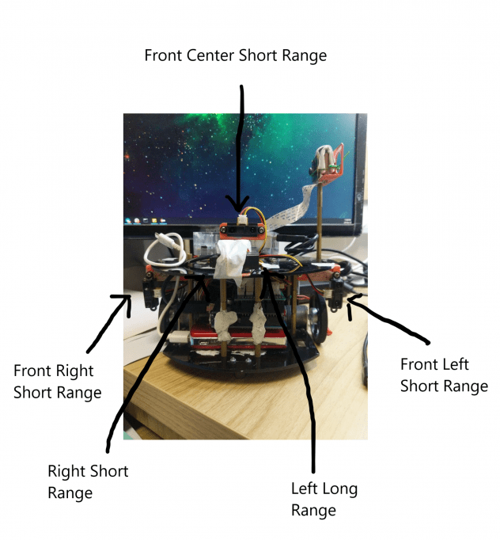

### Introduction

The 10-bit ADC Arduino microcontroller system is the brain of the robot, which handles both the movement of the robot as well as the sensory functions. Thus, the arduino team is expected to build the robot from scratch, working with hardware all the way. We're supposed to implement basic motor movement functions, some sensory capabilities and also provide a way to communicate with the other teams.

### Robot Structure

 Fig. 1 Structure of the robot

### Sensors

We are using 5 sensors as follows:

1.  Front Left (Short Range)
2.  Front Right (Short Range)
3.  Front Center (Short Range)
4.  Right (Short Range)
5.  Left (Long Range)

Since our team went with right wall hugging, we chose to attach a long range sensor to the left side of the robot so that it could discover the center of the maze.

  

Fig. 2 IR Sensor characteristics

As we can see from Fig. 2, the given IR sensors have a certain blind spot where 2 distance values can give the same voltage reading. To combat this issue, all the sensors were placed as close to the center of the robot as possible. 

**Sensing:** For conversion of raw voltage values of the sensor into distance values, the [SharpIR](https://github.com/guillaume-rico/SharpIR) library was used. This library finds the median of 31 readings and converts it into a distance value (in cm).

**Position:** Initially, the sensors were placed higher than the present value. When they were higher, we noticed that the sensors often gave erroneous values. We found out that this was because of the images attached to the blocks for image detection. To solved this, we placed a few sensors below the chassis.   

**Grid Conversion:** Distance value to grid conversion is done by the Arduino. The procedure for finding the grid conversion bounds was as follows:

1.  Place block at 15cm from the center of the robot to obtain the upper bound for grids=1
2.  Place block at 25 cm from the center of the robot to obtain the upper bound for grids=2
3.  For any greater value, take the distance to be 3cm

Note that this is the procedure for short range sensors. A similar procedure was applied for the long range sensor except we found values till grids=5 and took any value above that as 6 Note: Something peculiar which occurred was that comparing sensor values with the bounds sometimes gave the wrong result (e.g. 17.05 > 17.04 gave the output as false). This lead to many grid conversions being false. We later found that float comparison in C++ is very inaccurate and decided to first multiply the float by 100, convert it to integer, and only compare the integer values. This resulted in much more reliable results. The camera was positioned at a height to ensure best results from our image detection model, as the images themselves were positioned at the top 1/4 of the block using Velcro.

### Position and Rotation Calibration

Due to variations in the movement of the robot, it is necessary to calibrate the rotation and distance of the robot from the wall every few steps. We implemented the following features for doing so:

1.  Distance calibration using Front Left
2.  Distance calibration using Front Right
3.  Distance calibration using Front Center
4.  Rotation calibration using Front Left and Front Center
5.  Rotation calibration using Front Left and Front Right
6.  Rotation calibration using Front Center and Front Right
7.  Right side rotation calibration using Right Front and Right Back (not used in final iteration)

This was done to ensure that the robot could calibrate even if it had just 1 or 2 blocks in front of it. The last feature was removed since adding a 6th IR sensor lead to over loading of the power regulator board and gave rise to inaccurate sensor readings for all sensors. The process for **rotation calibration** was as follows:

1.  Read 2 sensors, multiply their values by 100 and convert to integer
2.  Find different between the 2 sensor readings and compare to pre-determined ideal different
3.  If different lesser than ideal, rotate one side; otherwise, rotate to the other side
4.  Continue doing this for 80 iterations (counter was used to ensure robot does not keep calibrating for a long time)

The process for **distance calibration** was as follows:

1.  Read sensor, multiply its value by 100 and convert to integer
2.  Compare distance with pre-determined ideal distance
3.  If lesser, move backwards; otherwise, move forwards

### Key Hardware Components

- **Arduino Uno R3** : an entry-level Arduino with 10-bit ADC hardware, 12 pins of Digital I/O and 5 pins of Analog Input.
- **Pololu DualVNH5019 Motor Shield & 47:1 DC Motor with Encoder** : used to control the two DC motors with the Arduino Uno. The robot control system also incldues the quadrature encoders, the motor shield and lastly, the motors. This combination allows for robust and accurate movements of robot.
- **Power Regulator PCB** : SCSE fabricated Power Regulator for easy and neat connections between sensor/encoder pins and arduino. Allows for 6 infrared sensors and 2 encoders to be connected at the same time, along with an additional ultrasonic sensor.
- **Sharp IR Sensors** :  2 types of IR sensors are provided:
  - **Sharp GP2Y0A21YK IR sensor** (effective range 10-80 cm)
  - **Sharp GP2Y0A02YK IR sensor** (effective range 20-150cm)
- **SLA 6V Battery :** Provides power to the entire robot.

### Robot Motion Control (PWM and PID)

- **Introduction :** Straight movement of the robot is one of the most basic functional requirements, and while it may seem like an easy task to achieve, it may prove to be quite challenging, This is because the motors provided may not run at the same speed when provided with the same voltage. This difference in motor speed causes the robot to turn , making it difficult to achieve straight  line motion. The motor movement speeds might also depend upon certain external factors like the weight distribution of the robot, voltage of the battery etc.In order to combat this problem, we first tried to match the left and right motor speeds through manual tuning of parameters, based on encoder output. This is known as **open loop control**, and it was not accurate enough for the straight line motion of the robot. In addition, the tuning parameters needed to be changed and tuned repeatedly, as the motor speed changed every time the battery level changed, or the weight distribution of the robot was altered.This led us to think of a method which was self-correcting in nature, and which wouldn't need to be altered every time the battery level and weight distribution changed. As a result, it was decided that it is necessary to adopt a **closed-loop control**l methodology. In this method, continuous feedback of motor actual speed and adjustments in motor speed at run-time make them spin at relatively same time, thus facilitating accurate straight line motion and rotations. PID control is one of this close-loop control, which is widely used in industry.

- **PWM (Pulse Width Modulation) Control** In order to change the speed of the robot, the input voltage to the motor needs to be changed. However, it is very difficult to change the voltage in such a manner in the provided 6V DC Power Supply. Instead of varying the voltage level, PWM (Pulse-width modulation) is used to  to control the speed of the DC Motor. The basic idea of PWM is that it uses a square wave with a fix voltage value for logic 1 and 0 but different duty cycles to control the speed. According to the duty, the PWM switches the motor on (1) and off (0) continuously. This is how the required voltage is achieved.

- **Quadrature Hall Effect Encoders:** The microcontroller supplies the motors with PWM signals via the motor shield and make them spin. While the motors spin, the hall effect encoders are also spinning due to electromagnetic force from the motor and generate square wave signals.Using edge-triggered interrupts, the Arduino microcontroller captures the rising/falling edge of the encoders’ signals and increase “ticks” count. This is done using two separate Interrupt Service Routine (ISR), which are triggered when their corresponding interrupt-enabled digital pins detect an edge change in their input (from the encoders). Using the tick value and time elapsed between each tick (rising/falling edges of square wave), we can calculate the actual speed of the motors since each DC motors generate approx. 2249 ticks (rising and falling edges of square waves across 2 channels in total) per full revolution.Arduino microcontrollers then compare the actual speed with whatever supplied and adjust the PWM/speed supply to the motor shield to ensure the two motors move as close to the ideal speed as possible. A PID controller is implemented here to actualize the above workflow as it is commonly used in robotics for the same purpose.

- **PID Controller:** PID Control is to calculate an error value as the difference between a measured variable and a desired set-point. Then this error is going to be adjusted proportionally, integrally and derivatively to compensate for the input signal. After an oscillation of the measured variables, the measured variable would finally become stable and reach the desired set-point. This is an example of a closed-loop control technique.For our project, we set
  - Input : Difference between left and right encoder ticks
  - Output : Left Motor Speed
  - Setpoint : 0

Thus to achieve PID, we set the right motor speed as a constant, and let PID algorithm alter the left motor speed according to the difference in encoder ticks. After correctly tuning the PID Parameters, the PID was complete. It was then possible to achieve accurate straight line motion and exact rotations.

### Libraries Used

1.  [DualVNH5019MotorShield (For motor movement)](https://github.com/pololu/dual-vnh5019-motor-shield)
2.  [PID_v1 (For enabling PID)](https://github.com/br3ttb/Arduino-PID-Library)
3.  [EnableInterrupt (For enabling interrupts on non-interrupt pins)](https://github.com/GreyGnome/EnableInterrupt)
4.  [SharpIR (For conversion of sensor voltage into distance values)](https://github.com/guillaume-rico/SharpIR)
5.  [ArduinoSort (For finding median of sensor values)](https://github.com/emilv/ArduinoSort)
