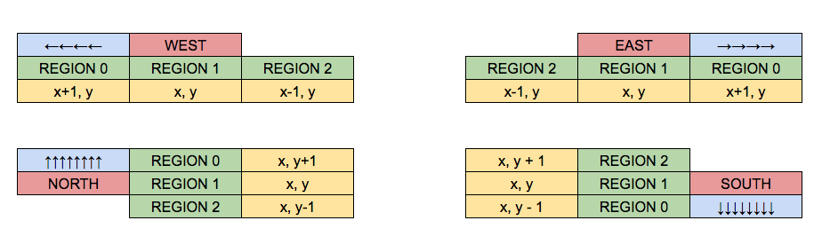

# 1. Description of implementation

The aim/goal of the image recognition/object detection module is to be as fast as possible. As such, we are trying to minimise on the time taken when the Algorithm initiates the "take picture command" to when Android receives the "image detected" message.

As such the main object detection code will not be performed on the Raspberry Pi and will be executed remotely on another computer.

There will be a Python script that will keep the camera warmed up and ready to take a picture whenever a take picture command is sent. This will reduce the time required to take a picture from roughly 2.8 seconds (2 seconds for the camera to warm up) to approximately 0.6 seconds to take a picture.

With such an implementation, it will take approximately 0.7 to 0.8 seconds to take a picture and process it, most of which, can happen asynchronously after the initial 0.6 seconds where the robot will need to stay still when the image is taken.

1. Whenever RPi receives a take picture command from TCP `@r_x_y_orientation!`. 
The coordinates and orientation will be saved as a file in a folder (**coords_orien**) with filename (`x_y_orientation`). 
The file will have no contents.

2. There will be Python script "polling" the **coords_orien** folder. 
If it sees a file (or an increase in number of files), it will take the file name, take a picture and save the image as **x_y_orientation.jpg** (same as the file name) and save it to a folder, **images_to_scan**. 
The polling is done at every 35ms.

3. To ensure that the robot stays still whenever the picture is taken, an *ACK* is required to be sent back to Algorithm before the next action is initiated. 
The communication hub's camera thread will continuously poll the **images_to_scan** to check if the **x_y_orientation.jpg** image has already been taken. 
If the image is taken, it will rename the **x_y_orientation.jpg** image to **x_y_orientation_ACK.jpg** and send an ACK to Algorithm. 
This process will loop for 1000 iterations. 
If the image is not taken, Algorithm will not receive an *ACK* and will send a take picture command again.

4. We have another Python script on the same PC running the algorithm for exploration and fastest path to run YOLOv3 - object detection, which will constantly scan the folder, **images_to_scan** where all images awaiting object detection are saved via FTP.
Once it has finish scanning an image, it will delete the image that was scanned from **images_to_scan**, reducing the number of images in the **images_to_scan** folder.

5. If an object is detected, it will save it back to RPi via FTP as an image with the name **id,x,y.jpg** in an output folder named, **images_found** and also, on the PC to be displayed later in a single window, as part of the laboratory requirements.

6. After it has receive *DONE* (explore done) command from TCP, it will create a **DONE** file in the input folder **coords_orien**.

7. Once PC sees the **DONE** file via FTP, and it has finished scanning all the images in **images_to_scan** it will display all the images in ONE single window.

8. RPi will then read all the image filenames in the **images_found** folder and send it to Bluetooth as separate packets for each image in **images_found** with the filename of the images as packet contents.

# 2. Object Position
Depending on the position of the bounding box, the **coord_orien** in the form of `x_y_orientation` needs to be resolved.
`x_y_orientation` is the center of the obstacle detected by the robot.

To illustrate this, assume that the camera is facing right. An object is detected on the image `2_10_NORTH`. This means that the robot is facing **NORTH**. Hence, this means that the camera is facing **EAST**.
 
The image is delimited to three zones, hence, it will have 2 delimiters (d1, d2). In such a state, there will be 3 case:
1. Center of bounding box of detected object < d1
2. Center of bounding box of detected object >= d1 and < d2
3. Center of bounding box of detected object >= d2

The resulting coordinates of the image should be resolved as such:
| no. | state                    | region | coord. of object | robot orient. |
|-----|--------------------------|--------|------------------|---------------|
| 1   | bb_center < d1           | 0      | id,2,11          | NORTH         |
| 2   | bb_center >= d1 and < d2 | 1      | id,2,10          | NORTH         |
| 3   | bb_center >= d2          | 2      | id,2,9           | NORTH         |

The visualisation for the mapping is illustrated below, note that the camera is facing **RIGHTWARDS**.
The delimiters `d1` and `d2` are visualised as the border lines between `REGION 0` AND `REGION 1` and `REGION 1` and `REGION 2` respectively.

[](doc_resources/region_x_y.png)

As such, if the camera is facing rightwards, the generalisation below holds:

```python
x = coordinate_x
y = coordinate_y

if region == 1:
    # Center region; x,y coordinates will never change
    pass
elif region == 0:
    # Top region
    if ORIENTATION == "NORTH":
        y += 1
    elif ORIENTATION == "SOUTH":
        y -= 1
    elif ORIENTATION == "EAST":
        x += 1
    elif ORIENTATION == "WEST":
        x -= 1
    else:
        print("Invalid orientation")
elif region == 2:
    # Bottom region
    if ORIENTATION == "NORTH":
        y -= 1
    elif ORIENTATION == "SOUTH":
        y += 1
    elif ORIENTATION == "EAST":
        x -= 1
    elif ORIENTATION == "WEST":
        x += 1
    else:
        print("Invalid orientation")
```

# 3. How to run
Included in this section are the instructions to run object detection.

## 3.1 Dependencies
The Python code requires the RPi to have FTP. 
FTP was preferred over SFTP as Python's FTPlib does not support SFTP.

To enable FTP on the Raspberry Pi (RPi), run the following commands below in terminal, while connected to the RPi.

```shell script
sudo apt-get update
sudo apt-get install vsftpd
```

Open up the config file by entering the following command.
```shell script
sudo nano /etc/vsftpd.conf
```

Add or uncomment (Remove the #) for the following settings:
```shell script
anonymous_enable=NO
local_enable=YES
write_enable=YES
local_umask=022
chroot_local_user=YES
user_sub_token=$USER
local_root=/home/$USER/
```

If you try to copy to FTP, it will not work but listing of FTP/files will work. This is so as teh home directory is not configured properly yet.
Configure it by replacing <user> with the relevant user, for example:
Create the FTP directory so transferring of files is permitted. 
The root directory is not allowed to have write permissions so a sub-folder called files is needed.

```shell script
mkdir /home/<user>/FTP
mkdir /home/<user>/FTP/files
chmod a-w /home/<user>/FTP
```

Restart the service by entering the following command.
```shell script
sudo service vsftpd restart
```

Connect over plain FTP (Port 21) should be enabled after all the steps above are performed.


## 3.2 Performing Object Detection / Running

Note that `Step 2` is **OPTIONAL** as the RPi binary initialises this script for the user. This reduces the number of commands that the user will need to run during the 2 minutes preparation time. 
1. Ensure that all required devices (Serial, Bluetooth, Serial) are connected after running the `RPi` communication hub binary.
2. **(NOTE: THIS IS NOT NECESSARY UNLESS YOU ARE DEBUGGING.**) In a separate terminal window with the RPi connected, run the `Object\ detection/rpi/img_event_handler.py` Python script. 
3. On a preferred laptop with the required `opencv2` and `darknet/yolov3` dependencies installed, run the `Object\ detection/client/obj_detect_client.py` Python script.

## 3.3 Object detection model

1. Our team made use of YOLO model as the method to perform object detection.
2. The YOLO model was trained on top of `darknet53.conv.74` model downloaded from https://pjreddie.com/darknet/yolo/
3. Images of the signs were taken manually, with different angles. More than 2000 images were used to train the model.
4. Model was trained using 1 of our laptop with a GPU. We stop the training process after the accuracy of validation set stopped increasing.
5. The .weights file was then used as the object detection model in YoloOrchestrator.py

## 3.4 Sample output

Below is an example of the object detection output on a low frame rate feed that has been sped up by 8x.
 

Below is an example of output images that are stacked together horizontally and physically in a *2 x n* array as per required by the leaderboard guidelines. 
*n* is the number of rows denoted by the *total_number_of_detected_images/2*.


 

